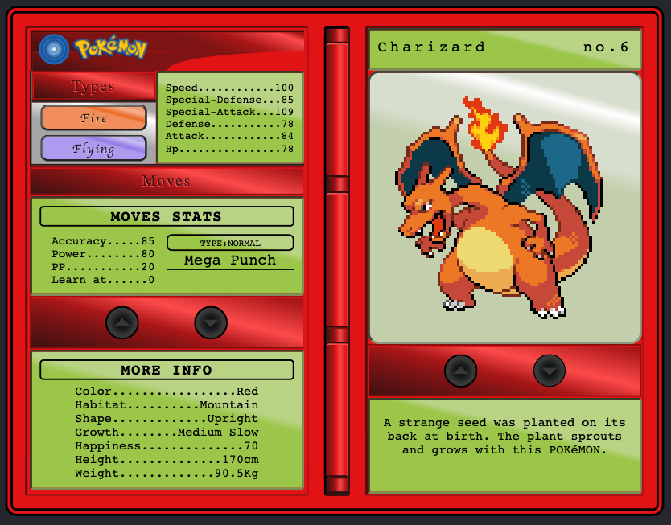

> [!NOTE]  
> Use legacy dependencies to run; it should work now with node 18

This project is built with react pokedex using TS (pure CSS approach)
### `$ yarn install`
Install all the necessary dependencies to run the project.

### `$ yarn start`

Runs the app in the development mode. 
Open [http://localhost:3000](http://localhost:3000) to view it in the browser.

**Note: This project was bootstrapped with [Create React App](https://github.com/facebook/create-react-app).**
